**t2-api-autotest 接口自动化测试框架**
=== 
## 框架模式
基于 pytest + allure + yaml + mysql + 钉钉通知 + Jenkins 实现的接口自动化框架
* git地址: [https://github.com/1inhai/t2-api-autotest.git](https://github.com/1inhai/t2-api-autotest.git)

## 框架介绍
为了抛弃臃肿庞大的测试框架，本框架将大部分测试用例操作前置，使得编写测试用例时无需导入各种乱七八糟的模块。
原计划是开发比较健全的自动生成用例功能，但是那样就又不得不去给yaml文件添加大量的字段来处理逻辑，而我开发这个框架的目的就是
为了让代码及数据简洁明了，所以最后取舍了一下，决定让这个框架具备自动生成基础测试用例的功能，同时也可以根据业务不同的需求去手动修改测试用例。

## 框架功能
* yaml管理测试数据，实现测试数据分离
* 支持自动生成测试用例，无需手动编写测试用例
* 支持不同接口间的数据依赖
* 支持数据库的增、删、改、查
* 支持yaml文件中的动态参数自动替换
* 支持测试完成后发送钉钉消息通知（其他平台后续也可以支持）
* 支持测试程序异常发送通知到邮箱
* 可轻易集成jenkins


## 整体目录结构
```
    ├── files                存放接口上传的文件
    ├── test_cases           存放测试用例
    ├── test_data            yaml格式测试数据
    ├── utils                存放各种封装方法
    ├── conftest.py          pytest钩子函数
    ├── pytest.ini           pytest执行脚本参数配置文件
    ├── run.py               全量执行用例
    ├── send_ding.py         钉钉消息通知  
    ├── config.yml           全局配置               
    ├── requirements.txt     依赖文件                  
    ├── Pipfile              虚拟环境依赖文件
    └── logs                 日志文件         
```
## 使用教程

#### 1、Gitee 拉取项目

需要先配置好python、jdk、allure环境

```shell
git clone https://github.com/1inhai/t2-api-autotest.git
```

#### 2、安装依赖

方式一：
直接安装依赖文件

```shell
pip install -r requirements.txt
```

方式二：
使用pipenv创建虚拟环境运行
```shell
"""配置虚拟环境"""

pipenv install # 根据根目录下的Pipfile创建一个新环境

pipenv --venv # 查看虚拟环境路径

/Users/用户/.local/share/virtualenvs/api_autotest-J3yMsRGU  # 创建的虚拟环境地址
```

```shell
"""激活虚拟环境"""

pipenv shell  # 激活虚拟环境

exit  # 退出虚拟环境

```


## 开始自动化测试
正式开始之前，需要先配置好全局配置文件config.yml
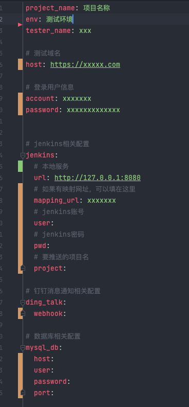


### 编写自动化用例

#### 第一步：创建yml测试文件(必须是.yml格式)
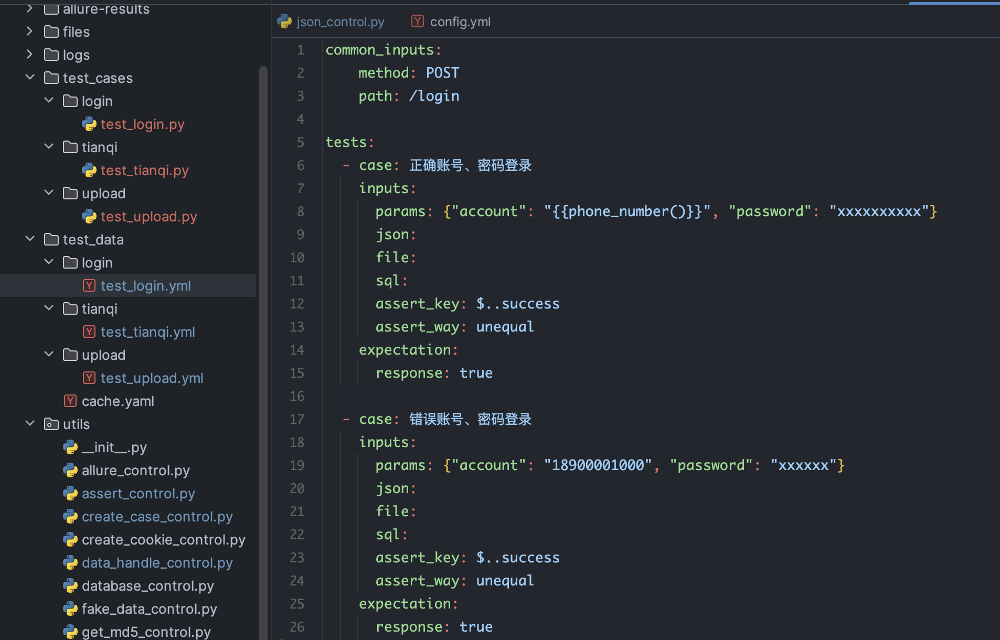

在test_data目录下的import目录中创建yaml文件，注：必须是二级目录下创建，通常业务也会划分模块。


字段说明:

* common_inputs: 请求方法，请求路径（只需要写域名后的路径即可）
* case: 用例名
* inputs: 用例输入
* params: 请求数据格式为表单类型时填写
* json: 请求数据格式为json类型时填写
* file: 请求上传的文件名，文件需要放在files目录下
* sql: sql语句
* assert_key: 自动生成用例时用到的断言key（使用jsonpath语法）
* assert_way: 自动生成用例时用到的断言方式（可以查看utils.assert_control中对应的断言方法）
* expectation: 用例输出
* response: 期望的接口返回值


#### 第二步：创建测试用例文件

注：登录获取认证在utils.requests_control.py，用于存放token及cookie会话


#### 先说第一种方式：自动生成测试用例
运行run.py文件时会根据yml文件自动生成用例（也可以手动调用utils.create_case_control里的方法生成），如果yml对应的测试用例py文件已经存在是不会创建的，
这里只会创建不存在的测试用例文件。

生成的用例位置及内容如下：
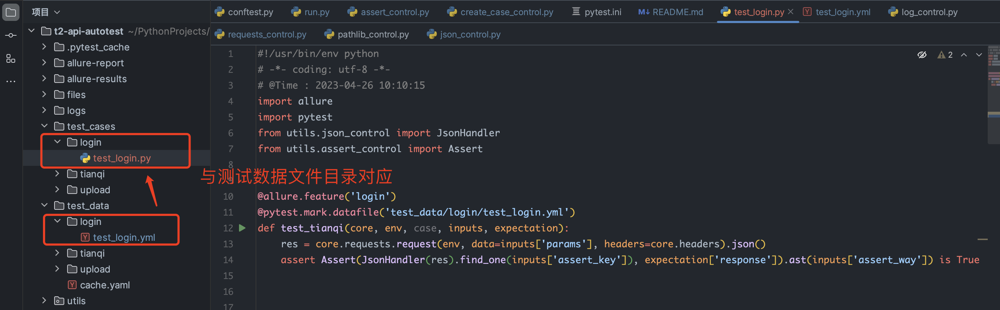
如果只需要校验接口返回码或是一些返回字段的值，那么这个用例可以直接使用，
但是实际业务场景中通常情况比较复杂，就需要在生成的用例上手动再修改代码逻辑
（不过这样至少省去了一些重复的创建文件工作不是吗？）


#### 再说第二种方式：手动编写/修改测试用例
同样的，需要在test_cases下的二级目录中创建yml文件，目录层级与test_data保持一致

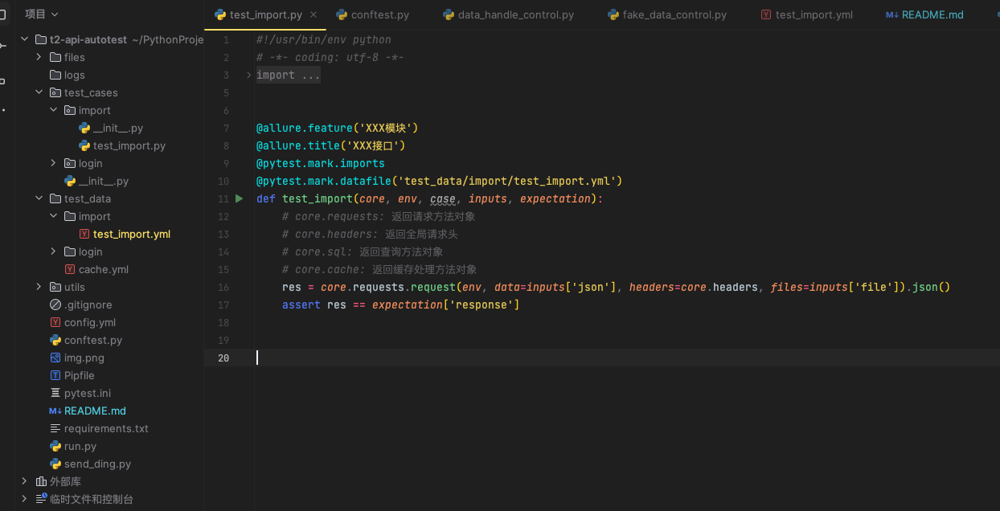

字段说明:

* allure.feature: 模块名称

* allure.title: 用例名称

* pytest.mark.upload 用upload标记这条用例，后续可以执行指定标记的用例（也可以不填写，会自动打上该测试用例所在模块的mark标记，例如此用例在import模块下，那会自动添加@pytest.mark.import标记）

* pytest.mark.datafile: 需要使用的yaml测试数据（需要从test_data目录开始写，千万不能写错）

* 测试函数必须test_*开头，重点说测试用例的入参：

  1、core: 可返回四个对象，core.headers（全局请求头）、core.requests（请求方法对象）、core.sql（数据库查询方法对象）、 core.cache（缓存方法对象）
  
* 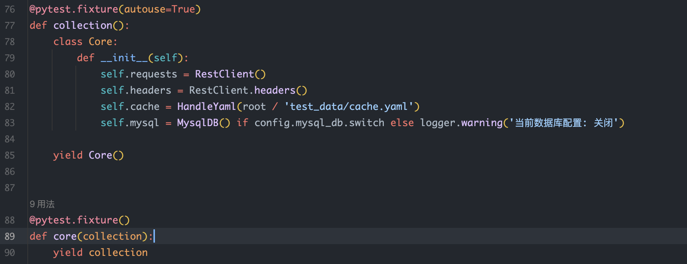

  2、env: 请求地址+请求方法组成的元祖数据（使用时确保两边配置文件填写正确即可，正常传入），请求地址：config.yml配置文件中的host以及对应测试用例中的path拼接，请求方法：对应测试用例中的method
  
  3、case: 用例对应yaml文件中的case名称，可在做不同校验时作为判断条件

  4、inputs: 用例对应yaml文件中inputs内容，使用时直接用获取字典值的方式获取:

  * 如果是上传文件的接口，可以参考前面截图中的样式填写，只需要填写files目录下的文件名即可（该文件需要放在files目录下，且文件名要保持一致）

  * 如果请求参数需要动态参数，需要用"{{xxx}}"这种双引号和双括号包裹的方式填写。该方法基于faker库封装，所以xxx部分内容填写的是faker对象返回的所有方法，也可以自己在utils.fake_data_control
  文件中的Mock类中自已定义一些方法。以下是使用示例:
  
  #### 直接调用方法：
  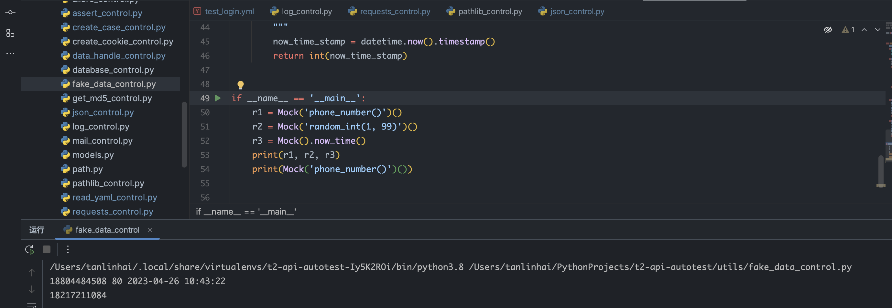
  
  #### yaml数据替换：
  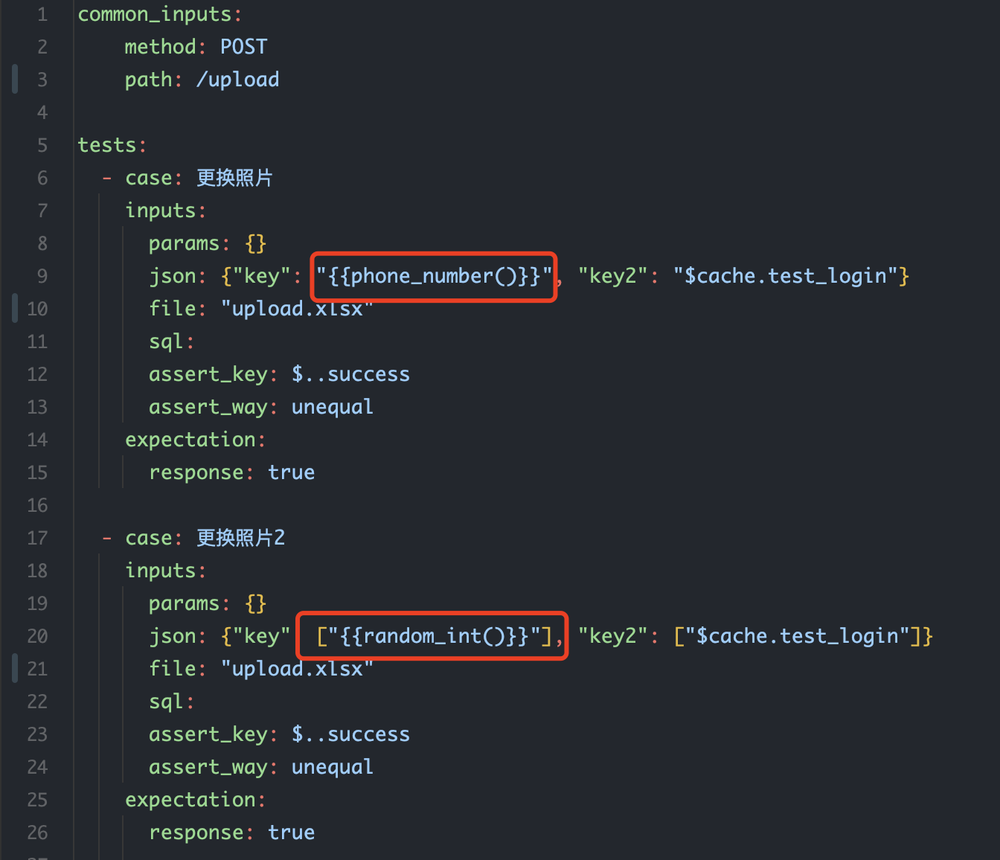
  支持任何嵌套格式的替换。

    
* expectation: 用例对应yaml文件中expectation内容，使用时可以直接用字典值方式获取

### 接下来看看如何操作缓存数据：

#### 添加缓存数据:

  调用cache.add_cache()方法把数据添加到test_data目录下的cache.yml文件中。
  
  有两个参数，第一个参数是存储的key值，第二个参数是存储的value值。
  
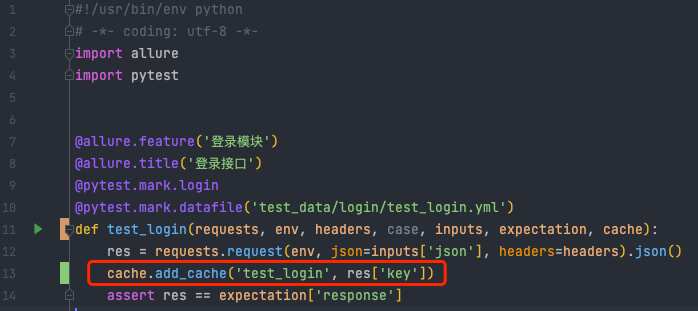

存储在cache.yml文件中的数据如下：
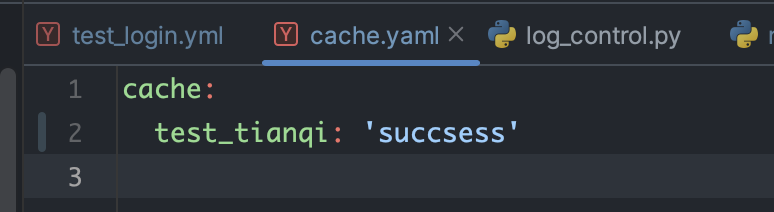


#### 使用缓存数据:

  在添加缓存数据时，最好是使用添加缓存数据的用例名称作为缓存的key值，后续用例需要使用该key值时，只需要在yaml文件中使用"$cache.xxxx"来替换缓存数据，注意必须要用该格式填写，其中xxxx部分为
  添加缓存数据的key。例如：上图中我在test_login.py用例中添加了key为test_login的缓存数据，那我在test_import用例的yaml文件中就可以按如图所示方法使用（需要用pytest.mark.run(order=1)装饰器保证添加缓存的用例执行必须在使用缓存的用例前）
  
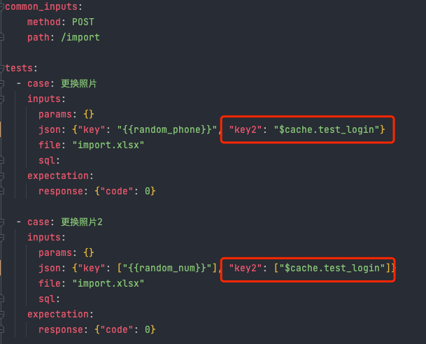


### 如何运行

```shell

python run.py  # 全量执行用例，生成测试报告保存在allure-report目录下

python run.py -m login  # 执行被@pytest.mark.login标记的所有用例

python send_ding.py  # 发送测试结果到钉钉通知,如果jenkins和config.yml都配置好了，可以直接使用

```

### 运行测试用例看下效果

控制台展示：
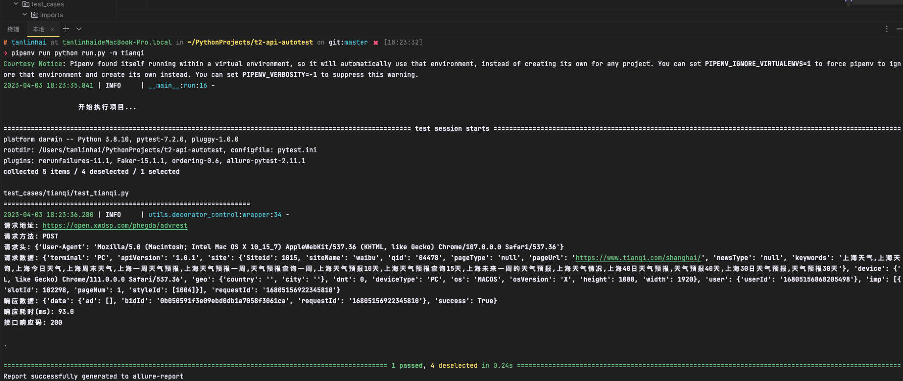

日志文件展示：
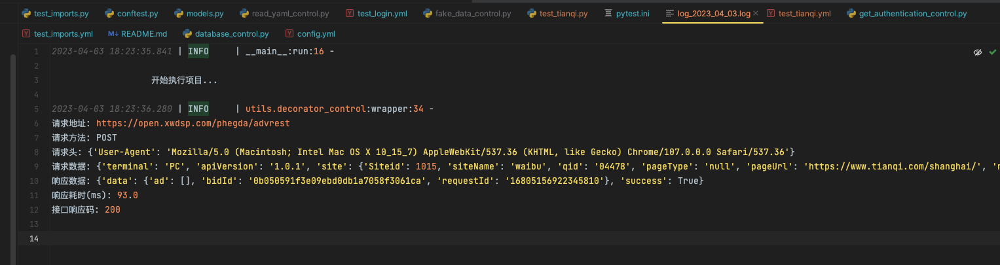

最后会生成详细的测试报告：
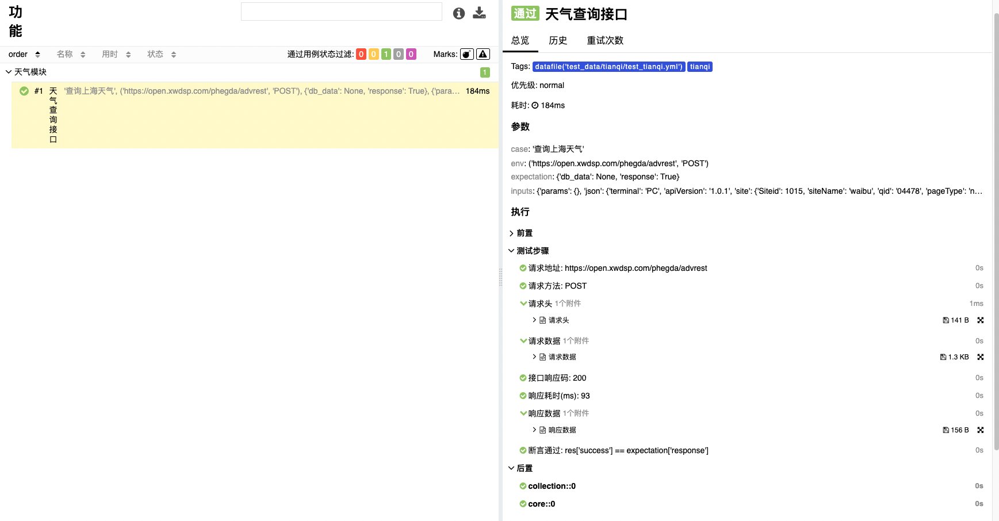

钉钉通知样式：

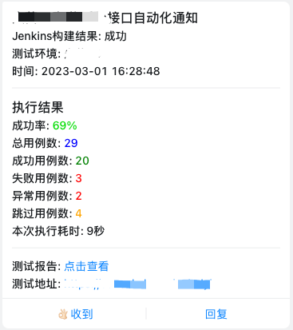


## 最后
框架还有许多能优化的地方，如果有什么好的建议欢迎一起来讨论。当然喜欢的话也可以留下一个星星✨再走。

遇到问题可以直接提issue或联系vx（工作日几乎每天在线，遇到问题都会第一时间回复）: 

