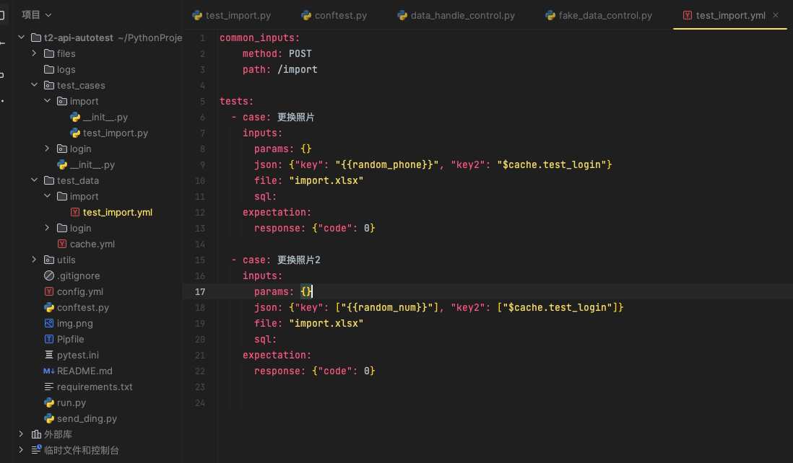

**t2-api-autotest 接口自动化测试框架**
=== 
## 框架模式
基于 pytest + allure + yaml + mysql + 钉钉通知 + Jenkins 实现的接口自动化框架
* git地址: [https://github.com/tan1inhai/t2-api-autotest.git](https://github.com/tan1inhai/t2-api-autotest.git)

## 框架介绍
为了抛弃臃肿庞大的测试框架，本框架将大部分代码逻辑通过conftest文件实现前置，使得编写测试用例时无需导入各种乱七八糟的模块。

## 框架功能
* yaml管理测试数据，实现测试数据分离
* 支持不同接口间的数据依赖
* 支持数据库的增、删、改、查
* 支持yaml文件中的动态参数自动替换
* 支持测试完成后发送钉钉消息通知
* 可轻易集成jenkins


## 目录结构
```
    ├── files                存放接口上传的文件
    ├── test_cases           存放测试用例
    ├── test_data            yaml格式测试数据
    ├── utils                存放各种封装方法
    ├── conftest.py          pytest钩子函数
    ├── pytest.ini           pytest执行脚本参数配置文件
    ├── run.py               全量执行用例
    ├── send_ding.py         钉钉消息通知  
    ├── config.yml           全局配置               
    ├── requirements.txt     依赖文件                  
    └── Pipfile              虚拟环境依赖文件         
```
### 使用教程

#### 1、Gitee 拉取项目

需要先配置好python、jdk、allure环境(不懂的自行百度)

```shell
git clone https://github.com/tan1inhai/t2-api-autotest.git
```

#### 2、安装依赖

方式一：
直接安装依赖文件

```shell
pip install -r requirements.txt
```

方式二：
使用pipenv创建虚拟环境运行
```shell
"""配置虚拟环境"""

pipenv install # 根据根目录下的Pipfile创建一个新环境

pipenv --venv # 查看虚拟环境路径

/Users/用户/.local/share/virtualenvs/api_autotest-J3yMsRGU  # 创建的虚拟环境地址
```

```shell
"""激活虚拟环境"""

pipenv shell  # 激活虚拟环境

exit  # 退出虚拟环境

```

## 配置项目的通用配置


## 编写测试用例

### 创建yaml测试文件


在test_data目录下的login目录中创建yaml文件，注：必须是二级目录下创建，通常业务也会划分模块。

字段说明:

* common_inputs: 请求方法，请求路径（只需要写域名后的路径即可）
* case: 用例名
* inputs: 用例输入
* params: 请求为get类型时填写
* json: 请求为post类型时填写
* file: 请求上传的文件名，文件需要放在files目录下
* sql: sql语句
* expectation: 用例输出
* response: 接口返回数据体

创建好了yaml测试数据，就可以创建测试用例文件了
### 创建测试用例文件


同样的，在test_cases下的login目录中创建yaml文件，目录层级与test_data保持一致

字段说明:

* allure.feature: 模块名称

* allure.title: 用例名称

* pytest.mark.imports 用imports标记这条用例，后续可以执行指定标记的用例

* pytest.mark.datafile: 需要使用的yaml测试数据（需要从test_data目录开始写，千万不能写错）

* 测试函数必须test_*开头，重点说各个入参的字段

* requests: 封装好的实例化请求方法，根据请求方式直接调用requests.request，如图中的res所示

* env: 请求地址+请求方法组成的元祖数据（使用时确保两边配置文件填写正确即可，正常传入），请求地址：config.yml配置文件中的host以及对应测试用例中的path拼接，请求方法：对应测试用例中的method

* headers: 以静态方法存放在utils.requests_control文件的RestClient类中，可按需更改

* case: 用例对应yaml文件中的case名称，可在做不同校验时作为判断条件

* inputs: 用例对应yaml文件中inputs内容，使用时直接用获取字典值的方式获取，

    1、如果是上传文件的接口，可以参考前面截图中的样式填写，只需要填写files目录下的文件名即可 

    2、如果请求参数需要动态参数，需要用"{{xxx}}"这种双引号和双括号包裹的方式填写，名称必须是utils.fake_data_control.py文件Execute类中定义的方法名，可以按需添加

    
* expectation: 用例对应yaml文件中expectation内容，使用时可以直接用字典值方式获取

* sql: 数据库实例化方法，可以通过sql.query('xxxx'), sql.execute('xxxxx')方式调用，使用时直接使用yaml文件中的sql语句：sql.query(inputs['sql'])（当然也可以直接写）

* cache: 缓存依赖数据，使用方式如下
* 添加缓存数据：
  

    cache.add_cache()方法把数据添加到test_data目录下的cache.yml文件中


* 使用缓存数据：
  

约定在添加缓存数据时，使用添加缓存数据的用例名称作为缓存的key值，后续用例需要使用该key值时，只需要在yaml文件中使用"$cache.xxxx"来替换缓存数据，注意必须要用该格式填写，其中xxxx部分为
添加缓存数据的key。例如：上图中我在test_login.py用例中添加了key为test_login的缓存数据，那我在test_import用例的yaml文件中就可以按如图所示方法使用（需要用pytest.mark.run(order=1)装饰器保证添加缓存的用例执行必须在使用缓存的用例前）

### 运行测试用例

```shell

python run.py  # 全量执行用例，生成测试报告保存在allure-report目录下

pipenv run.py -m login  # 执行被@pytest.mark.login标记的所有用例

python send_ding.py  # 发送测试结果到钉钉通知,如果jenkins和config.yml都配置好了，可以直接使用

```

钉钉通知样式：


## 最后
框架还有许多能优化的地方，如果有什么好的建议欢迎一起来讨论。当然喜欢的话也可以留下一个星星✨再走。

遇到问题可以直接提issue或联系v:Tlh_0717

